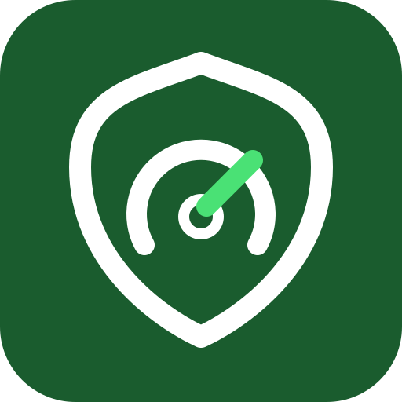
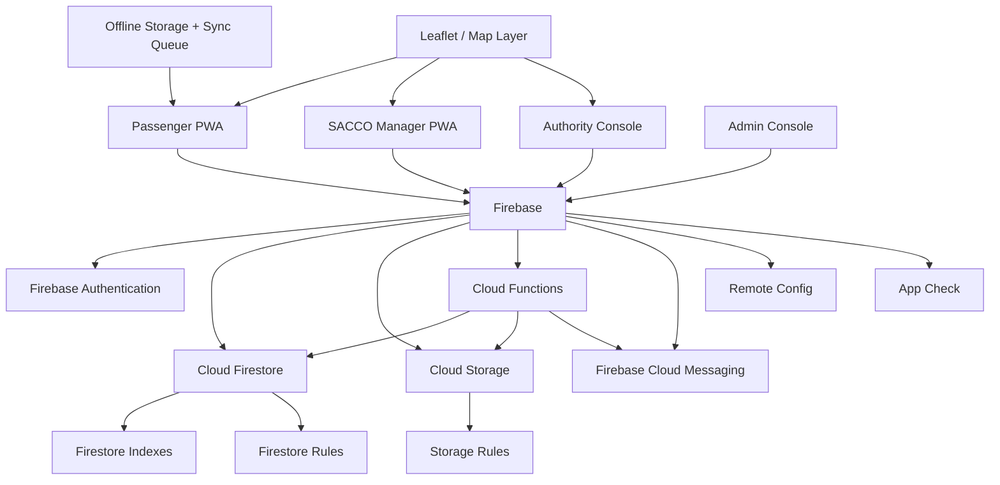

# 🛡️ Mwendo Salama

<p align="center">
  
</p>

<h3 align="center">Securing Every Journey</h3>

<p align="center">
  A safety-first civic mobility platform for Kenya's public service transport ecosystem.
  <br />
  <strong>Travel safer. Arrive safer.</strong>
</p>

---

## 🚦 What is Mwendo Salama?

**Mwendo Salama** is a national PSV safety, incident-awareness, passenger-protection and SACCO compliance platform designed around one principle: **make every journey more observable, accountable and safer.**

The platform connects passengers, SACCO operators, transport authorities and platform administrators through role-specific experiences while keeping security boundaries enforced at the application, Cloud Functions and Firebase rules layers.

It brings together:

- 🚌 **Trip and vehicle safety monitoring**
- 📍 **Live location and safety-map awareness**
- ⚠️ **Black-spot reporting and visibility**
- 🚨 **Emergency SOS workflows**
- 📣 **Safety alerts and notifications**
- 📊 **SACCO analytics and compliance visibility**
- 🧾 **Complaints, violations and inspections**
- 🔐 **Role-based access, MFA and privileged administration**
- 📶 **Offline-first trip/report persistence and reconciliation**
- 🌍 **English and Swahili experiences**
- 📱 **Installable PWA with resilient app-shell caching**

> **Mwendo Salama is not just a dashboard. It is a safety workflow connecting the passenger, operator and regulator around the same journey.**

---

## ✨ Platform at a glance

| Area | What Mwendo Salama provides |
|---|---|
| 👤 Passenger | Start and monitor trips, view trip history, inspect safety information, report black spots, receive alerts and trigger SOS |
| 🏢 SACCO Manager | Fleet, drivers, live trips, violations, reports, analytics, black spots, notifications, users and SACCO settings |
| 🏛️ Authority | National/county oversight, compliance, inspections, black spots, emergency response, complaints, reports and analytics |
| 🛠️ Admin | Users, roles, SACCOs, authorities, vehicles, trips, moderation, feature flags, system health, monitoring, audit logs and integrations |
| 🔥 Firebase | Authentication, Firestore, Storage, Cloud Functions, Hosting, App Check and messaging integrations |
| 📡 Resilience | Local persistence, offline queues, retry handling and reconciliation for important passenger workflows |
| 🗺️ Maps | Safety-map visualization, vehicle/incident markers, route traces and safety overlays |

---

## 🧭 Core user journeys

### Passenger journey

```text
Welcome / Register / Login
          │
          ▼
   Passenger Dashboard
          │
     ┌────┼───────────────┐
     ▼    ▼               ▼
 Start  Safety Map       Alerts
 Trip     │               │
  │       ├─ Black spots  │
  │       └─ Incidents    │
  ▼                       │
Active Trip ◄─────────────┘
  │
  ├── Live telemetry / location
  ├── Offline persistence
  ├── Evidence / incident reporting
  └── Emergency SOS
```

### SACCO operations journey

```text
SACCO Manager
     │
     ▼
 Dashboard ──► Fleet ──► Drivers
     │             │
     │             └────► Vehicle status / ownership
     │
     ├── Live Trips ──► Operational visibility
     ├── Violations ──► Review / dispute workflow
     ├── Black Spots
     ├── Reports
     ├── Analytics
     ├── Notifications
     └── Users / Settings
```

### Authority journey

```text
Authority
   │
   ▼
Oversight Dashboard
   │
   ├── Compliance
   ├── Inspections
   ├── Emergency response
   ├── Complaints
   ├── Black spots
   ├── Reports
   └── County / national analytics
```

### Platform administration

```text
Admin
 │
 ├── Users & roles
 ├── SACCOs & authorities
 ├── Vehicles & trips
 ├── Reports & moderation
 ├── Feature flags
 ├── System health
 ├── Monitoring
 ├── Audit logs
 ├── Analytics
 ├── Notifications
 ├── Integrations
 ├── Security
 └── Maintenance / settings
```

---

## 🎨 Experience and design

Mwendo Salama is built as a **mobile-first, safety-oriented PWA** rather than a desktop-only administration tool.

The interface supports:

- clear safety severity states
- responsive layouts for passenger and operational screens
- reusable cards, badges, dialogs, buttons and loading states
- branded application shells per role
- accessible interaction patterns
- route-level code splitting with retry behavior
- installable PWA metadata and service-worker caching
- English 🇬🇧 and Swahili 🇰🇪 localization
- graceful loading, empty, network-error and maintenance states

The product identity intentionally combines **mobility + protection**: the brand mark uses a shield and speedometer motif, while the primary product language emphasizes safe movement and arrival.

---

## 🏗️ Architecture



### Frontend

The web application is a React + TypeScript application built with Vite. Routing is role-aware and split into dedicated shells for passengers, SACCO managers, authorities and administrators.

The application initializes authentication and offline synchronization centrally, while Firebase configuration is guarded before normal application services start.

### Backend

Firebase Cloud Functions provide trusted server-side operations such as:

- authentication/MFA workflows
- vehicle risk computation
- SOS handling
- black-spot reporting
- inspection creation
- analytics generation
- public-pin synchronization
- scheduled purge/archival/report processing
- privileged user administration

The deployed Functions inventory is maintained explicitly in [`docs/cloud-functions-inventory.md`](docs/cloud-functions-inventory.md).

### Data and security

Firestore is protected by default-deny rules with explicit role/ownership checks. SACCO managers are scoped to their authoritative SACCO claim, authorities operate within their authority scope, and privileged operations are separated from ordinary client writes.

Storage follows the same fail-closed approach and applies ownership, file-type and size constraints to protected upload paths.

---

## 🔐 Security model

Security is treated as a **defense-in-depth concern**, not merely a frontend routing feature.

### Identity and roles

The application distinguishes the major operating roles:

- `passenger`
- `sacco_manager`
- `authority`
- `admin`

Role-gated routes use authoritative authentication state and fail closed when the required role cannot be established.

### Firestore

The rules layer enforces, among other controls:

- signed-in and non-suspended identity checks
- owner-only passenger mutations where appropriate
- authoritative active-role checks
- SACCO tenant isolation
- authority/admin privilege boundaries
- validated Kenyan geographic coordinates
- plausible speed ranges
- vehicle-to-SACCO consistency
- restricted lifecycle mutations
- immutable client-side audit logs
- default-deny fallback behavior

See [`firestore.rules`](firestore.rules) for the authoritative policy.

### Storage

Protected files are scoped to the authenticated owner or approved workflow, with explicit size/type restrictions and default-deny behavior.

See [`storage.rules`](storage.rules).

### App Check and production configuration

Firebase App Check is integrated into the application, while production configuration is guarded by `scripts/check-production-config.js` so a production build cannot silently target the demo/test Firebase configuration.

### Privileged operations

Administrative mutations are handled through trusted Cloud Functions and audit logging rather than relying on client-side role claims alone.

---

## 🚨 Safety capabilities

### Emergency SOS

Passengers can initiate an emergency workflow from the dedicated SOS experience. The flow is designed around trusted trip identity, validated location information, rate limiting and resilient notification handling.

### Black spots

Passengers can report hazardous locations from the safety experience. Reports can be persisted locally when connectivity is unavailable and synchronized when the connection returns.

### Safety map

The map experience exposes safety-relevant geographic information and supports markers for vehicles, black spots and incidents.

### Live trip visibility

Active passenger trips can persist telemetry locally and reconcile with the backend. SACCO and authority experiences provide operational views of relevant live activity according to their authorization scope.

### Notifications

Firebase Cloud Messaging support provides the foundation for safety alerts and operational notifications, with token registration and delivery lifecycle handling in the messaging service.

---

## 📶 Offline-first behavior

Connectivity should not be the point where a safety workflow becomes unusable.

Mwendo Salama maintains local queues for important workflows including trips and black-spot reports. The synchronization service:

1. discovers queued work;
2. attempts synchronization;
3. tracks retry state;
4. handles transient failures;
5. prevents concurrent drains;
6. reconciles successful writes; and
7. leaves unresolved work available for another attempt.

The service has a bounded retry policy rather than retrying forever.

---

## 🌍 Localization

The product ships with English and Swahili translations and persists the selected language locally.

| Language | Code | Product intent |
|---|---|---|
| English | `en` | Primary international/technical language |
| Kiswahili | `sw` | Local-first Kenyan passenger and operator experience |

The application branding includes:

> **Mwendo Salama — Usalama wa Kila Safari**

and the English equivalent:

> **Mwendo Salama — Securing Every Journey**

---

## 🧰 Technology stack

### Frontend

| Technology | Purpose |
|---|---|
| React 19 | UI framework |
| TypeScript | Type-safe application development |
| Vite | Development server and production bundling |
| React Router | Role-aware application routing |
| TanStack Query | Server-state fetching and caching |
| Zustand | Client/application state |
| Tailwind CSS | Utility-first styling |
| React Hook Form + Zod | Form handling and validation |
| Leaflet | Maps and geographic visualization |
| Recharts | Operational analytics and reporting visuals |
| i18next | Localization |

### Firebase / backend

| Technology | Purpose |
|---|---|
| Firebase Authentication | Identity and sessions |
| Cloud Firestore | Operational and safety data |
| Firebase Storage | Evidence, telemetry and user assets |
| Cloud Functions | Trusted backend workflows |
| Firebase Cloud Messaging | Notifications |
| Firebase App Check | Application integrity protection |
| Firebase Hosting | SPA hosting and deployment |
| Remote Config | Runtime configuration/feature control |

### Engineering quality

| Tooling | Purpose |
|---|---|
| Vitest | Unit/integration tests |
| React Testing Library | UI behavior tests |
| Firebase Emulator Suite | Rules and backend integration validation |
| ESLint | Static analysis |
| TypeScript compiler | Type checking |
| Firebase Rules Unit Testing | Firestore/Storage authorization tests |
| Bun | Reproducible dependency installation |

---

## 📁 Repository structure

```text
.
├── src/
│   ├── components/          # Shared UI, shells, maps, forms and system components
│   ├── features/
│   │   ├── auth/             # Login, registration, verification and MFA
│   │   ├── passenger/        # Passenger journeys and safety workflows
│   │   ├── sacco/            # SACCO operations and analytics
│   │   ├── authority/        # Regulatory oversight and emergency response
│   │   ├── admin/            # Platform administration and monitoring
│   │   └── common/           # Shared/system experiences
│   ├── repositories/         # Firestore data access boundaries
│   ├── services/             # Auth, messaging, offline sync, storage, etc.
│   ├── store/                # Zustand application state
│   ├── locales/              # English and Swahili translations
│   ├── lib/                  # Firebase, validation, utilities and domain helpers
│   ├── routes/               # Application routing and role guards
│   └── types/                # Shared domain types
├── apps/functions/
│   └── src/                  # Firebase Cloud Functions
├── public/
│   ├── brand/                # Canonical brand artwork
│   ├── sw.js                 # PWA service worker
│   └── manifest.json         # Installable PWA metadata
├── scripts/                  # Build, security and production checks
├── tests/                    # Test support and E2E journey gate
├── docs/                     # Release, security and function readiness records
├── firestore.rules           # Firestore authorization policy
├── firestore.indexes.json    # Composite Firestore indexes
├── storage.rules             # Storage authorization policy
├── firebase.json             # Firebase deployment configuration
├── vite.config.ts            # Frontend/build/test configuration
└── package.json              # Root scripts and dependencies
```

---

## 🚀 Getting started

### Prerequisites

Recommended tooling:

- Bun
- Node.js 22 for Firebase Functions
- Java 21 for Firebase Emulator Suite rules tests
- Firebase CLI

### Install dependencies

```bash
bun install --frozen-lockfile
```

### Configure the frontend

Copy the example configuration:

```bash
cp .env.example .env
```

Populate the required Firebase variables:

```dotenv
VITE_FIREBASE_API_KEY=
VITE_FIREBASE_AUTH_DOMAIN=
VITE_FIREBASE_PROJECT_ID=
VITE_FIREBASE_STORAGE_BUCKET=
VITE_FIREBASE_MESSAGING_SENDER_ID=
VITE_FIREBASE_APP_ID=
```

Optional integrations include:

```dotenv
VITE_RECAPTCHA_SITE_KEY=
VITE_FIREBASE_VAPID_KEY=
VITE_MAP_TILE_URL=
```

Never commit production secrets or private credentials. The frontend configuration contains public Firebase client configuration; privileged credentials belong only in trusted deployment infrastructure.

### Start the development server

```bash
bun run dev
```

The Vite server listens on port `3000` by default.

### Build the application

```bash
bun run build
```

### Preview the production build

```bash
bun run preview
```

---

## 🧪 Quality gates

The project has dedicated checks for the major release surfaces.

### Frontend

```bash
bun run lint
bun run typecheck
bun run build
bun run check:bundle-security
```

### Tests

```bash
bun run test
bun run test:coverage
```

### Firebase rules

```bash
bun run test:rules
```

The rules test command runs Firestore and Storage tests through the Firebase Emulator Suite.

### Functions

```bash
bun run --prefix apps/functions lint
bun run --prefix apps/functions build
```

### Production configuration

```bash
bun run check:production-config
```

This check intentionally fails unless the required production Firebase identity/configuration matches the expected production project values.

---

## 🔥 Firebase local development

The repository is configured for Firebase Hosting, Firestore, Storage and Cloud Functions. Hosting rewrites all application routes to the SPA entry point, while Functions use Node.js 22.

For emulator-driven development, use the Firebase CLI with the repository's `firebase.json` configuration.

Typical local workflow:

```bash
firebase emulators:start
```

For rules-focused validation:

```bash
bun run test:rules
```

Keep production and emulator credentials/configuration separated. Production configuration is intentionally checked by the deployment gate.

---

## ☁️ Cloud Functions

The backend exposes trusted callable, HTTP and scheduled functions. The authoritative inventory is maintained in [`docs/cloud-functions-inventory.md`](docs/cloud-functions-inventory.md).

Key capabilities include:

- `verifyTotpChallenge` — MFA challenge verification
- `computeVehicleRisk` — vehicle/trip risk computation
- `sendSOS` — emergency alert workflow
- `reportBlackSpot` — safety report workflow
- `createInspection` — authority inspection creation
- `rebuildSaccoAnalytics` — SACCO analytics rebuilding
- `updateDailyAnalytics` — daily analytics updates
- `syncPublicPins` — public map-pin synchronization
- `suspendUser` / `reactivateUser` — privileged account lifecycle
- `healthCheck` — backend health endpoint
- `dailyPurge` — retention cleanup
- `weeklyReport` — weekly reporting
- `monthlyArchival` — long-term archival

Scheduled operations are designed to process work in bounded batches and tolerate repeated execution without continually recreating or rewriting completed work.

---

## 🗄️ Data model overview

The platform centers its data around operational entities such as:

```text
users
 ├── passenger identity / preferences
 ├── role / activeRole
 ├── SACCO or authority association
 └── notification / consent state

saccos
 ├── fleet
 ├── drivers
 ├── team users
 ├── trips
 ├── violations
 └── operational analytics

vehicles
 ├── registration
 ├── SACCO ownership
 ├── inspection / insurance state
 └── risk state

trips
 ├── passenger
 ├── vehicle / SACCO
 ├── route
 ├── lifecycle state
 └── location / telemetry

safety_alerts / complaints / violations
 └── passenger → operator → authority workflows

black_spots / public_pins
 └── geographic safety intelligence

inspections / audit_logs / analytics
 └── regulatory and operational accountability
```

Firestore composite indexes are maintained in [`firestore.indexes.json`](firestore.indexes.json).

---

## 🛡️ Release-readiness

The repository includes a dedicated readiness ledger at [`docs/release-readiness.md`](docs/release-readiness.md).

The completed engineering hardening includes:

- default-deny Firestore and Storage security posture
- role and tenant isolation
- authentication and MFA safeguards
- consent/age validation
- GPS and speed validation
- SOS protection and rate limiting
- offline queue/retry handling
- analytics determinism and date validation
- scheduled-job retry-safe batching
- production Firebase identity checks
- SPA/deep-link hosting configuration
- bundle security checks
- automated unit/integration/rules coverage

The remaining release ledger items are intentionally separated into **environment-dependent acceptance checks**, including live production service verification, critical browser journeys, backup/restore evidence, alerting and representative mobile-performance measurements.

This distinction is deliberate: a green repository test suite is necessary, but it is not the same thing as proving every production dependency works in the live environment.

---

## 📋 Operational documentation

| Document | Purpose |
|---|---|
| [`docs/release-readiness.md`](docs/release-readiness.md) | Production-readiness ledger and final acceptance blockers |
| [`docs/implementation-backlog.md`](docs/implementation-backlog.md) | Prioritized engineering/audit backlog |
| [`docs/cloud-functions-inventory.md`](docs/cloud-functions-inventory.md) | Authoritative deployed Function inventory |
| [`firestore.rules`](firestore.rules) | Firestore authorization policy |
| [`storage.rules`](storage.rules) | Storage authorization policy |
| [`firestore.indexes.json`](firestore.indexes.json) | Firestore composite indexes |
| [`.env.example`](.env.example) | Required/optional local configuration |

---

## 🧑‍💻 Development principles

### Safety before convenience
If a workflow touches identity, location, emergency state or regulated operational data, the server and security rules must be able to reject unsafe input independently of the UI.

### Fail closed
Missing authentication, missing role claims, suspended accounts and invalid configuration should degrade into denial or an explicit configuration state—not accidental privilege.

### Tenant isolation
SACCO-scoped data must remain scoped to the authoritative SACCO identity. A client-provided identifier is never sufficient proof of tenancy.

### Offline resilience
A temporary network failure should not unnecessarily destroy a passenger's local journey state or safety report.

### Deterministic retries
Scheduled and asynchronous work should converge safely when execution is repeated.

### Accessible by default
Critical passenger and safety actions need clear states, predictable controls and non-color-only communication.

### Evidence over assumptions
Release documentation distinguishes between automated repository evidence and live production verification.

---

## 🗺️ Roadmap

### Current focus

- Complete critical role-based browser journeys.
- Finish the remaining function-by-function security evidence matrix.
- Complete production Firebase dependency smoke checks.
- Verify backup/recovery and critical-function alerting.
- Measure real-device/mobile performance under constrained connectivity.

### Next horizon

- Broader end-to-end coverage beyond the critical journeys.
- Expanded low-end Android performance budgets.
- Deeper operational diagnostics and dashboards.
- Additional notification channels where formally required.

---

## 🤝 Contributing

When changing Mwendo Salama:

1. Preserve role and tenant boundaries.
2. Validate untrusted input at the appropriate trusted boundary.
3. Add or update tests for security-sensitive behavior.
4. Keep Firestore/Storage rules aligned with application behavior.
5. Keep Function inventory and release documentation synchronized.
6. Avoid committing environment secrets.
7. Run the relevant quality gates before merging.

For substantial changes, document the security, data, offline and operational implications rather than only the UI behavior.

---

## 📜 Project status

**Mwendo Salama is an actively hardened civic-mobility safety platform.**

The repository's automated quality suite has been reported as passing, and the engineering hardening programme has reached its final acceptance stage. Live production checks remain the final distinction between **engineering-complete** and **production-verified**.

---

<p align="center">
  <strong>🚌 Mwendo Salama</strong><br />
  <em>Travel safer. Arrive safer.</em>
  <br /><br />
  <strong>Usalama wa Kila Safari.</strong>
</p>
